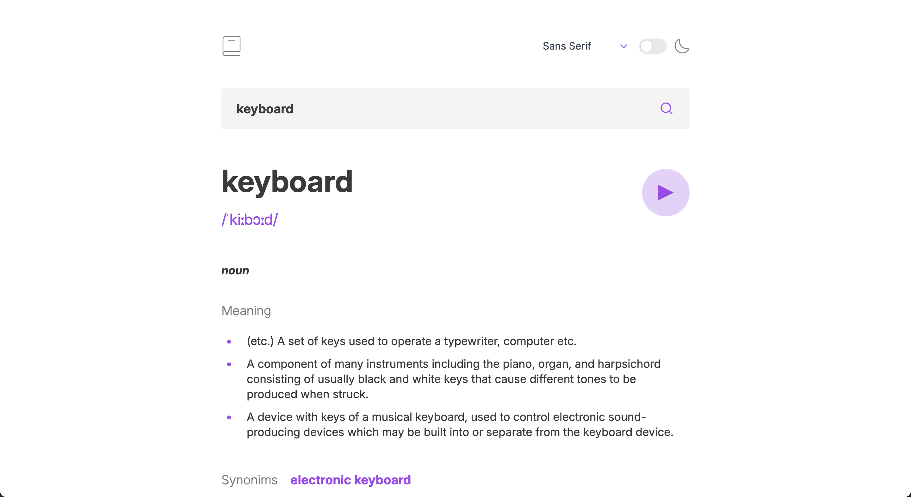
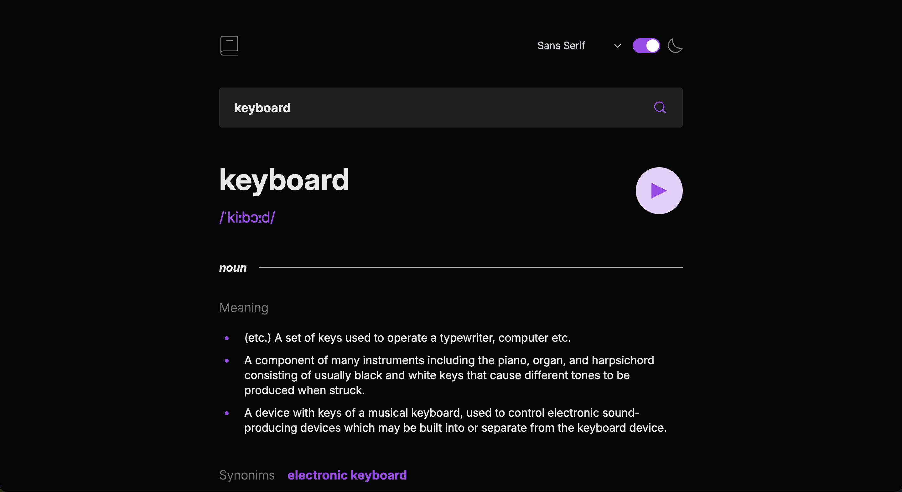
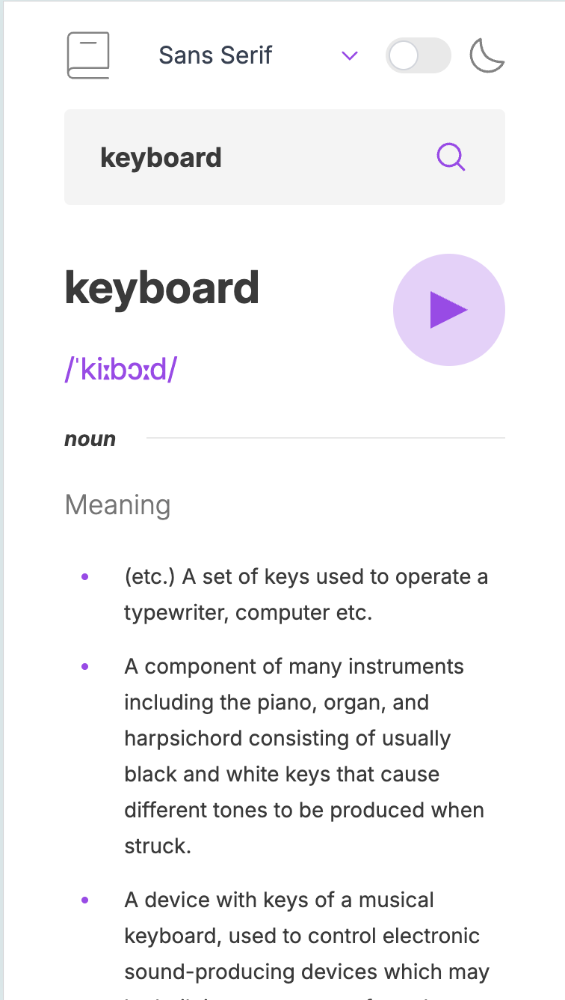
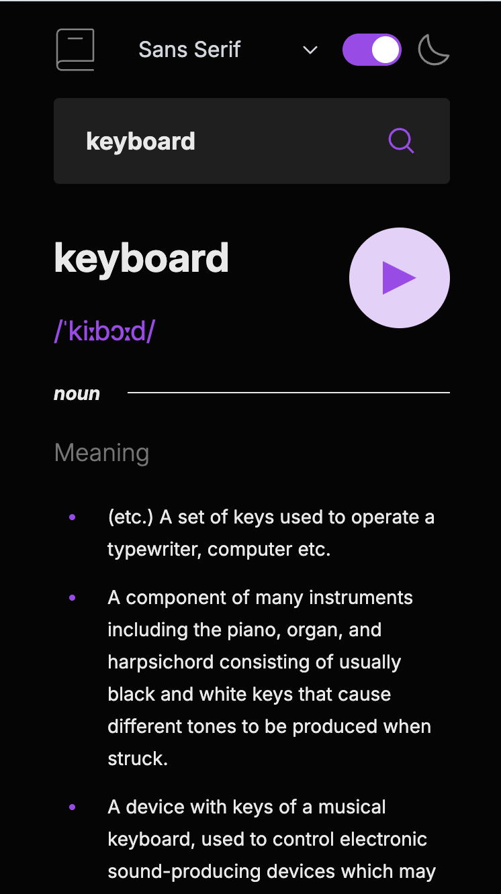

# Frontend Mentor - Dictionary web app solution

This is a solution to the [Dictionary web app challenge on Frontend Mentor](https://www.frontendmentor.io/challenges/dictionary-web-app-h5wwnyuKFL). Frontend Mentor challenges help you improve your coding skills by building realistic projects.

## Table of contents

- [Overview](#overview)
  - [The challenge](#the-challenge)
  - [Screenshot](#screenshot)
  - [Links](#links)
- [My process](#my-process)
  - [Built with](#built-with)
  - [What I learned](#what-i-learned)
- [Author](#author)

**Note: Delete this note and update the table of contents based on what sections you keep.**

## Overview

### The challenge

Users should be able to:

- Search for words using the input field
- See the Free Dictionary API's response for the searched word
- See a form validation message when trying to submit a blank form
- Play the audio file for a word when it's available
- Switch between serif, sans serif, and monospace fonts
- Switch between light and dark themes
- View the optimal layout for the interface depending on their device's screen size
- See hover and focus states for all interactive elements on the page
- **Bonus**: Have the correct color scheme chosen for them based on their computer preferences. _Hint_: Research `prefers-color-scheme` in CSS.

### Screenshot






### Links

- Solution URL: [Github](https://github.com/kurniawan26/dictionary-web-app)
- Live Site URL: [Netlify App](https://dictionary-web-app-fauzi.netlify.app/)

## My process

### Built with

- Semantic HTML5 markup
- CSS custom properties
- Flexbox
- CSS Grid
- Mobile-first workflow
- [React](https://reactjs.org/) - JS library
- [TypeScript](https://www.typescriptlang.org/) - Typed superset of JavaScript
- [Tailwind CSS](https://tailwindcss.com/) - For styles
- [React Context API](https://reactjs.org/docs/context.html) - For state management
- [Free Dictionary API](https://dictionaryapi.dev/) - For the dictionary API
- [React SWR](https://swr.vercel.app/) - For data fetching

### What I learned

Use this section to recap over some of your major learnings while working through this project. Writing these out and providing code samples of areas you want to highlight is a great way to reinforce your own knowledge.

To see how you can add code snippets, see below:

```js
const { data, error, isLoading } = useSWR(
  [URL, debounceValue],
  ([url, params]) => fetcher(url, params)
);
```

#### Explanation:

- **`useSWR`**: This is a React hook from the SWR library, which is used for data fetching. It simplifies handling remote data by providing features like caching, revalidation, and error handling.
- **Arguments**:
  - `[URL, debounceValue]`: This is the key used by SWR to identify and cache the data. It combines the URL and a `debounceValue` (likely used to delay requests).
  - `([url, params]) => fetcher(url, params)`: This is the fetcher function, which SWR uses to fetch data. It takes the `url` and `params` as arguments and passes them to a custom `fetcher` function.
- **Returned values**:
  - `data`: The fetched data.
  - `error`: Any error encountered during the fetch.
  - `isLoading`: A boolean indicating whether the data is still loading.

This pattern is useful for managing API calls in React applications, especially when you need to handle dynamic parameters like `debounceValue`.

## Author

- Frontend Mentor - [@kurniawan26](https://www.frontendmentor.io/profile/kurniawan26)
